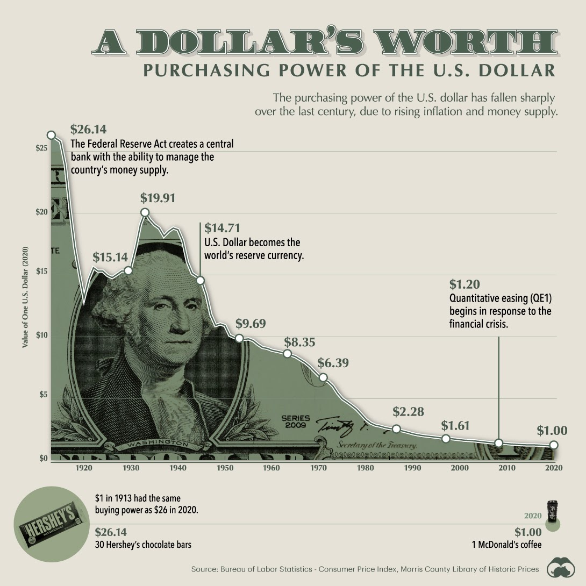

# Introduction

### What is Dimension C-137? 
 Dimension C-137 is a one of the many universes in the multiverse, this is the universe where 
 the author of this DAO (Eye patch Morty) was born. There are many currencies used on the planet (Earth) where
 "Eye patch morty" was born. Story to be continued ...
### What is a DAO?

### What is DeFi?

### What is reserve currency?

### But why? 


#### From Siam Kidd:
---
#### From The calculator Guy:
---
#### From Olympus:
- Olympus is a decentralized reserve currency protocol based on the OHM token. Each OHM token is backed by a basket of assets (e.g. DAI, FRAX) in the Olympus treasury, giving it an intrinsic value that it cannot fall below. Olympus also introduces unique economic and game-theoretic dynamics into the market through staking and bonding. Read more about the game theory aspect of Olympus in
- Our goal is to build a policy-controlled currency system, in which the behavior of the OHM token is controlled at a high level by the DAO. In the long term, we believe this system can be used to optimize for stability and consistency so that OHM can function as a global unit-of-account and medium-of-exchange currency. In the short term, we intend to optimize the system for growth and wealth creation.
-  The main benefit for stakers comes from supply growth. The protocol mints new OHM tokens from the treasury, the majority of which are distributed to the stakers. Thus, the gain for stakers will come from their auto-compounding balances, though price exposure remains an important consideration. That is, if the increase in token balance outpaces the potential drop in price (due to inflation), stakers would make a profit.
-  The main benefit for bonders comes from price consistency. Bonders commit a capital upfront and are promised a fixed return at a set point in time; that return is in OHM and thus the bonder's profit would depend on OHM price when the bond matures. Bonders benefit from a rising or static OHM price.
#### From Wonderland:

- Wonderland is the first decentralized reserve currency protocol available on the Avalanche Network based on the TIME token. Each TIME token is backed by a basket of assets (e.g., MIM, TIME-AVAX LP Tokens etc etc) in the Wonderland treasury, giving it an intrinsic value that it cannot fall below. Wonderland also introduces economic and game-theoretic dynamics into the market through staking and minting.
- Our goal is to build a policy-controlled currency system, native on the AVAX network, in which the behavior of the TIME token! In the long term, we believe this system can be used to optimize for stability and consistency so that TIME can function as a global unit-of-account and medium-of-exchange currency. In the short term, we intend to optimize the system for growth and wealth creation.
- We intend to achieve price flatness for a representative basket of goods without the use of fiat currency, in order to allow the cryptocurrency industry to detach once and for all from the traditional finance world!
-  The main benefit for stakers comes from supply growth. The protocol mints new TIME tokens from the treasury, the majority of which are distributed to the stakers. Thus, the gain for stakers will come from their auto-compounding balances, though price exposure remains an important consideration. That is, if the increase in token balance outpaces the potential drop in price (due to inflation), stakers would make a profit.
-  The main benefit for minters comes from price consistency. Minters commit a capital upfront and are promised a fixed return at a set point in time; that return is given in TIME tokens and thus the minter's profit would depend on TIME price when the minted TIME matures. Taking this into consideration, minters benefit from a rising or static price for the TIME token!


---

#### From Euphoria:

- Euphoria is an algorithmic reserve currency protocol on Harmony based on the WAGMI token. Each WAGMI token is backed by a basket of assets (e.g. DAI, UST, WAGMI-DAI LP Tokens, WAGMI-UST LP Tokens, etc) in the Euphoria Treasury, giving it an intrinsic value that it cannot fall below. Similar to Wonderland and Olympus, Euphoria also introduces economic and game-theoretic dynamics into the market through staking and purchasing bonds.
- In addition, we intend to bridge the gap between DeFi 1.0’s liquidity mining mechanisms and DeFi 2.0’s protocol owned liquidity mechanisms. ViperSwap and Euphoria can both be utilized to introduce new and unique mechanisms and products. We aim to combine the best that DeFi 1.0 has to offer with the best that DeFi 2.0 can offer.
- As part of the VenomDAO ecosystem, Euphoria can work synergistically with VIPER.
- Since VenomDAO already has an established treasury which has grown since ViperSwap was launched in March 2021, we have bootstrapped $192,766 into the initial Euphoria protocol without the need for prolonged whitelisting processes or having to rely on backdoor deals with VC:s. The protocol was announced, and initial liquidity was added to ViperSwap on November 7th 2021.
- This is the only way a truly fair launch can happen where Discord insiders or VC:s don’t have an upper hand and can dump on market participants.
- Eight months ago we fair launched ViperSwap on Harmony. Eight months later we’re still here, still pushing DeFi forward on Harmony.
- And now we intend to lead the Harmony ecosystem towards the path of DeFi 2.0.

[Introducing Euphoria: an algorithmic reserve currency protocol on Harmony](https://medium.com/venomdao/introducing-euphoria-an-algorithmic-reserve-currency-protocol-on-harmony-7581d17c38e8)
#### From Midas:
 - CROWN is a decentralized reserve currency based on bonding and POL concept introduced by Olympus DAO, where community is formed when everyone bonds (mints) the underlying assets into a common reserve currency, creating a strong “bonding” for the whole community.
  In accordance with this idea each CROWN token is backed by a basket of assets (MIM, CROWN-MIM LP etc) and other assets acquired during the second stage of project development, giving it an intrinsic value that it cannot fall below.

  The introduction is divided into the sections listed below:
  - What are the advantages of the structure based on POL (I)
    - Midas owns most of its liquidity thanks to its bond mechanism. This has several benefits:
      - Midas does not have to pay out high farming rewards to incentivize liquidity providers,
      - Midas guarantees the market that the liquidity is always there to facilitate sell or buy transaction,
      - By being the largest LP (liquidity provider), it earns most of the LP fees which represents another source of income to the treasury,
      - All POL (and other assets) can be used to back CROWN (to increase intrinsic value). As a result, the value of CROWN tokens is at least equal to the total value of assets held in the treasury, without taking into account future inflows from Midas' unique profit-generating strategies, which makes the value of the treasury grow steadily every day.
  - Project basic strategies (II)
    - There are two main strategies for market participants: staking and bonding. Stakers stake their CROWN tokens in return for more CROWN tokens, while Minters provide MIM or LP tokens in exchange for discounted CROWN tokens after a fixed vesting period.
    - The main benefit for stakers comes from supply growth. The protocol mints new CROWN tokens from the treasury, the majority of which are distributed to the stakers. Thus, the stakers gain from  their auto-compounding balances, though price exposure remains an important consideration. That is, if the increase in token balance outpaces the potential drop in price (due to inflation), stakers would make a profit.
    -  The main benefit for minters comes from price consistency. Minters commit a capital upfront and are promised a fixed return at a set point in time; that return is in CROWN and thus the Minter's profit would depend on CROWN price when the bond matures. Minters benefit from a rising or static CROWN price.
  - Midas' Kingdom (III)
  - Midas Touch (IV)
  - Get acquainted with proposed development stages, which distinguishes Midas from Olympus Dao and its forks (V)
  - Summary (VI)
   
---
  
#### From hector:

  - Stablecoins like USDT and USDC have become an integral part of the Crypto space. We use them to store non-volatile value, allowing us to maintain the same amount of purchasing power from day to day. Unfortunately, this isn’t actually how the US Dollar works. The Federal Reserve controls the minting of US Dollars, and it’s fiscal policies have consistently led to the depreciation of its currency. This means that a Dollar today is worth more than a Dollar tomorrow.

  
  - This is why Hector DAO exists. Bitcoin and Cryptocurrency in general was the first step towards decentralisation. Hector DAO is the next step towards this goal. The native currency of Hector, $HEC will serve as a reserve currency backed by assets owned and maintained by a truly decentralised, autonomous protocol.
  - Similarly to Olympus, HEC is backed by DAI and other assets owned by the reserve treasury, and will function in a very similar way: when HEC trades below DAI, the protocol will buy back and burn HEC, increasing its price to at least 1 DAI. This means that HEC will always be worth equal to, or more, than DAI.
  - Hector DAO aims to become the de-facto reserve currency of the FTM Opera network, one which is truly owned and maintained by a decentralised protocol which serves the majority. Our goal is for $HEC to be a common trading pair which is backed by real assets.
---
#### From Sol:
  
  - Sol Invictus is the decentralized reserve currency built on Solana. The Sol Invictus token is IN. Each IN token is backed by a basket of assets currently being USDC, USDT, mSOL & USDC LP tokens in the Invictus Treasury, giving the IN token an intrinsic value that it cannot fall below.
---

## Getting Started

Get started by **creating a new site**.

Or **try Docusaurus immediately** with **[docusaurus.new](https://docusaurus.new)**.

## Generate a new site

Generate a new Docusaurus site using the **classic template**:

```shell
npm init docusaurus@latest my-website classic
```

## Start your site

Run the development server:

```shell
cd my-website

npx docusaurus start
```

Your site starts at `http://localhost:3000`.

Open `docs/intro.md` and edit some lines: the site **reloads automatically** and displays your changes.
